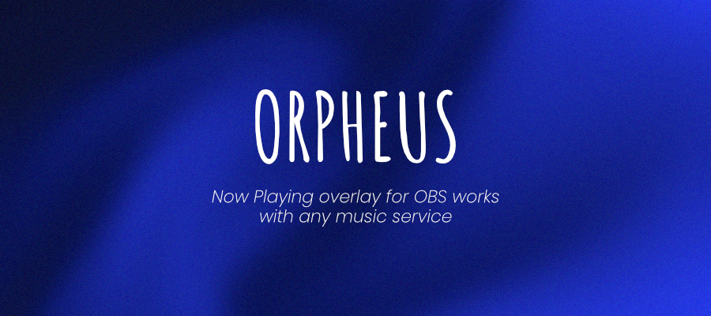
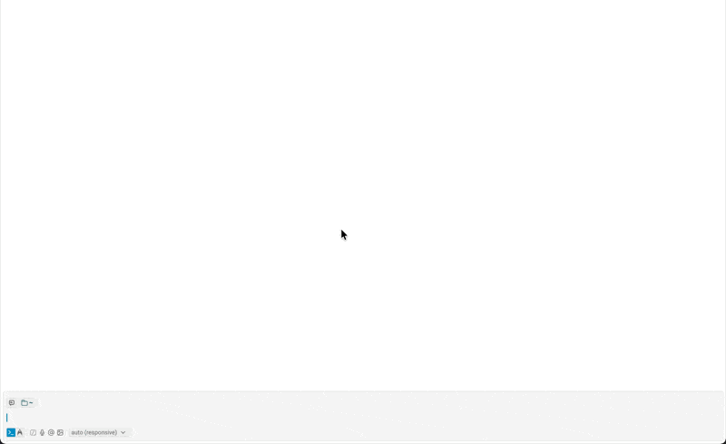

<div align="center">
  
</div>

<div align="center">

[![typescript-image]][typescript-url]
[![bun-image]][bun-url]
[![licence-image]][licence-url]

</div>

<br />

## Why Orpheus?

Display what you're listening to on your stream. Orpheus detects music from any app on macOS (Deezer, Spotify, Apple Music, YouTube...) and serves a customizable overlay for OBS.

- **macOS only** — Uses native MediaRemote framework
- **Universal detection** — Works with any music app (Spotify, Deezer, Apple Music...)
- **Real-time updates** — SSE streaming with <50ms latency
- **Community themes** — Install themes from GitHub with one command
- **Daemon mode** — Runs in background, no terminal needed



## Installation

```bash
brew install collectif-pixel/tap/orpheus
```

This automatically installs `media-control` as a dependency.

## Usage

```bash
# Start server (background)
orpheus start

# Start with custom port
orpheus start --port 8080

# Keep terminal open
orpheus start --foreground

# Check status
orpheus status

# Stop server
orpheus stop

# Show current track
orpheus now
```

Then add `http://localhost:4242/now-playing` as a Browser Source in OBS.

## Themes

```bash
# Browse & install from marketplace
orpheus search

# List installed themes
orpheus themes

# Install from GitHub
orpheus add @roseratugo/colorz

# Switch theme
orpheus use @roseratugo/colorz

# Update a theme
orpheus update @roseratugo/colorz

# Update all themes
orpheus update

# Remove theme
orpheus remove @roseratugo/colorz
```

### Create a Theme

Use the [theme template](https://github.com/Collectif-Pixel/orpheus-theme-template) to get started:

```bash
gh repo create my-theme --template Collectif-Pixel/orpheus-theme-template
```

A theme is a single `theme.html` file that connects to the SSE endpoint:

```html
<!DOCTYPE html>
<html>
<body>
  <div id="track"></div>
  <script>
    const es = new EventSource('/api/stream');
    es.addEventListener('track', (e) => {
      const { title, artist, artwork } = JSON.parse(e.data);
      document.getElementById('track').innerHTML = `${artist} - ${title}`;
    });
  </script>
</body>
</html>
```

### Publish to Marketplace

1. Push your theme to GitHub
2. Submit a PR to [orpheus-themes](https://github.com/Collectif-Pixel/orpheus-themes) registry

## API

| Endpoint | Description |
|----------|-------------|
| `GET /now-playing` | Serve current theme |
| `GET /api/now-playing` | Current track JSON |
| `GET /api/stream` | SSE real-time updates |
| `GET /api/health` | Health check |

## Development

```bash
git clone https://github.com/collectif-pixel/orpheus
cd orpheus
bun install
bun run dev
```

## License

[MIT](LICENSE)

[typescript-image]: https://img.shields.io/badge/Typescript-294E80.svg?style=for-the-badge&logo=typescript
[typescript-url]: https://www.typescriptlang.org
[bun-image]: https://img.shields.io/badge/Bun-%23000000.svg?style=for-the-badge&logo=bun&logoColor=white
[bun-url]: https://bun.sh
[licence-image]: https://img.shields.io/badge/License-MIT-green?style=for-the-badge
[licence-url]: LICENSE
